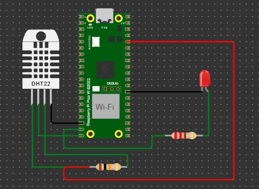
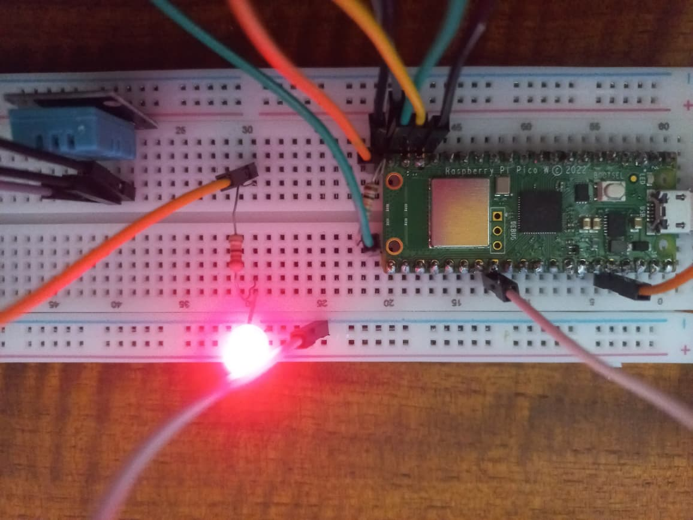

# Termostato con Raspberry Pi Pico W/2W, sensor DHT22 y relé

Este proyecto consistió en crear un termostato con un Raspberry Pi Pico W/2W, sensor DHT22 (temperatura y humedad) y relé que puede funcionar de modo manual o automático. Fue programado en MicroPython usando MQTT y basado en eventos. Se utilizaron funciones asincronas (`uasyncio`) para  para gestionar la conectividad de red, la lectura de sensores y el control de actuadores de manera eficiente y sin bloqueos de ejecución.

## Funcionalidad General

El sistema permite dos modos de operación principales:
1. **Modo Automático:** El relé se activa o desactiva comparando la temperatura medida por el sensor contra un *setpoint* configurado.
2. **Modo Manual:** El relé responde directamente a los comandos de encendido/apagado enviados a través del broker MQTT.

## Requerimientos Cumplidos

A continuación se detallan los ítems completados para la realización de esta tarea:

- [x] Programado en micropython utilizando asyncio (mqtt_as).
- [x] Utilización de alternativa basada en eventos mediante `uasyncio`, evitando el uso de "callbacks".
- [x] Publicación periódica en el tópico raíz `ID_DEL_DISPOSITIVO` de un objeto JSON con: temperatura, humedad, setpoint, periodo y modo.
- [x] Suscripción a tópicos de control específicos: `setpoint`, `periodo`, `destello`, `modo` y `rele`.
- [x] Almacenamiento no volátil en memoria Flash de los parámetros: `setpoint`, `periodo`, `modo` y `rele`.
- [x] Destellará por unos segundos cuando reciba la orden "destello" por mqtt.
- [x] Cuando recibe un mensaje con nuevos parámetros no volátiles, deberá actualizar los almacenados y actuar si es necesario.
- [x] Lógica de control en modo automático: Acción del relé supeditada a la temperatura de setpoint.
- [x] Lógica de control en modo manual: Acción del relé supeditada a la orden directa recibida por MQTT.
- [x] Funcionamiento validado en entorno simulado (Wokwi).
- [x] Funcionamiento validado en hardware real (Raspberry Pi Pico W).

## Simulación y Hardware

### Simulación en Wokwi
Para las pruebas de lógica y conectividad se utilizó el simulador Wokwi.
* **Link del proyecto:** [Acceder a la simulación aquí](https://wokwi.com/projects/461326229117039617)

*Captura del circuito en Wokwi*

### Implementación Física
El sistema se encuentra montado sobre una Raspberry Pi Pico W, utilizando un sensor DHT11 para las mediciones de temperatura y humedad.

*Raspberry Pi Pico W en funcionamiento, conectada a la red y ejecutando el código*
